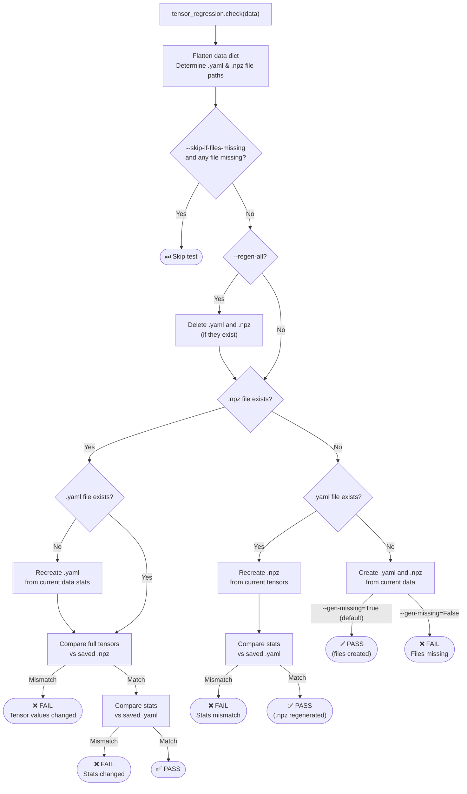

# tensor_regression
A small wrapper to simplify using [pytest_regressions](https://github.com/ESSS/pytest-regressions) with Tensors.

This adds the following to [pytest_regressions](https://github.com/ESSS/pytest-regressions):
- Simple Tensor statistics (min, max, mean, std, shape, dtype, device, hash, etc.) are generated and saved in a .yaml file.
  - The simple statistics are used as a pre-check before comparing the full tensors.
  - These yaml files can be saved with git without having to worry about accidentally saving huge files.
- Full tensors are moved to CPU and saved in a `.npy` file (same as ndarrays_regression), and these .npy files are gitignored.
- Adds a `--gen-missing` argument (default True) which will generate any missing regression files without raising error, as opposed to pytest-regression's `--regen-all` which regenerates all regression files.

## Flow

The following diagram illustrates the different cases that occur when calling `tensor_regression.check()`:

